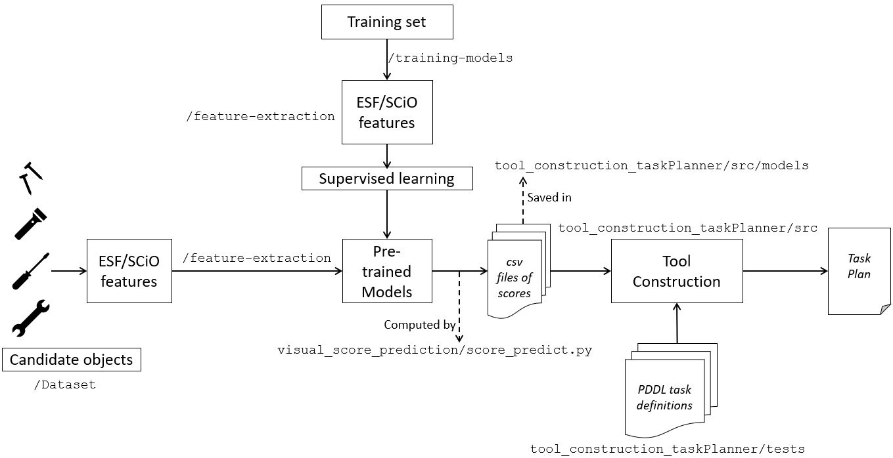
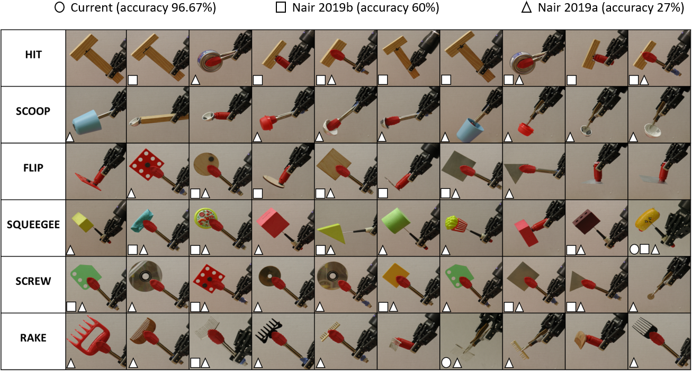

# Autonomous Tool Macgyvering for Inventive Problem Solving (Thesis Work)

**Advisor**: Dr. Sonia Chernova, Robot Autonomy and Interactive Learning ([RAIL](http://rail.gatech.edu/)) lab

**Collaborators**: Nithin Shrivatsav, Zackory Erickson, Jonathan Balloch

This repository contains code and datasets that were developed for my Ph.D. thesis at Georgia Institute of Technology. The goal of this work is to enable a robot to construct tools from a given set of parts. The high level approach is to compute a multi-objective function that includes the shape and material fitness of the parts for constructing the tool. Additionally, the multi-objective function includes a score that indicates whether the parts can be attached in the desired configuration. Given the three values, the robot scores the different object combinations for performing tool construction. We integrate the multi-objective function with a task planner to efficiently generate plans for tasks that involve tool construction. 

*NOTE: This work uses the SCiO handheld spectrometer available at* [https://www.consumerphysics.com/](https://www.consumerphysics.com/)

## Papers

If you find our work useful, please consider citing the following papers:

- **Nair, Lakshmi, et al. "Autonomous Tool Construction Using Part Shape and Attachment Prediction."** Robotics: Science and Systems (RSS). 2019.
- **Nair, Lakshmi, Jonathan Balloch, and Sonia Chernova. "Tool macgyvering: Tool construction using geometric reasoning."** 2019 International Conference on Robotics and Automation (ICRA). IEEE, 2019.

Thanks!

## Process Outline

The overall process is shown in the figure above. We start by training models that can predict shape and material fitness of objects. For details and code on the training process, see `training-models` folder. We use ESF features of point clouds as input to the shape prediction models, and SCiO spectral readings as input to the material prediction models. For the extraction of these features see `feature-extraction` folder. Once the models are trained, they are saved in the `visual_score_prediction/pre-trained-models` folder. 

To test our tool construction approach, we use a dataset of point clouds of 58 objects (see `Dataset` folder). We extract ESF features and SCiO features for each of these, and save them in the `visual_score_prediction/pre-extracted-features` folder. Then `score_predict.py` uses the pre-trained models and features to compute shape and material scores for each of the 58 objects, and save them onto csv files. These csv files are saved in the `tool_construction_taskPlanner/src/models` folder. 

Once the csv files are saved, the tool construction algorithm (see `tool_construction_taskPlanner/src`), takes the csv files as input along with task definitions in PDDL. The problem and domain definitions for the different tasks used for testing are available in the `tool_construction_taskPlanner/tests` folder. Our approach then generates a task plan that involves constructing the missing tool required for the task. 

## Repository Outline

This repository has the following folders:
- tool_construction_taskPlanner
- visual_score_prediction
- Dataset
- Feature-extraction
- Training-models
- Auxiliary 

**1) tool_construction_taskPlanner**

This folder contains code for performing task planning for tasks that involve tool construction. This code is adapted from the wonderful **Pyperplan** (See [https://github.com/aibasel/pyperplan](https://github.com/aibasel/pyperplan)). The general idea here is to compute *some* score (any good measure) that indicates how good object combinations are for constructing tools, and use that score within the planner. We have the following sub-folders that facilitate this:
- `src/models` contains csv files that save shape, material and attachment predictions from trained models. The planner simply reads from these to compute the score that is used during planning. For a given point cloud, the planner reads the shape, material, and attachment score from the csv file, computes the score using it (See `planner_interface.py`), and uses it during planning (See `search/astar.py`). The key code components that are modified include a) `src/planner_interface.py` that concerns with computing the scores (`src/object_score.py`), and integrating tool construction into the PDDL planner, b) `search/astar.py` where the score is incorporated in the heuristic and search, and c) `src/pyperplan.py` that puts everything together. 
- `tests` contains PDDL problem and domain definition files for three domains: Assembly, cooking, and cleaning.
- `dataset_cons` contains the point clouds that were used for testing, separated according to their functions. The functions "scoop" and "flip" are for the cooking domain; "screw" and "hit" are for assembly; and "rake" and "squeegee" are for cleaning. During planning time, the planner takes these point clouds and maps it to the objects "Obj0 - Obj9" in the problem definition. 

**2) visual_score_prediction**

This folder contains code that takes pre-trained models to predict and save the scores in csv files that are used by the task planner above. This folder does not contain code for training the models. Instead, for generating csv files from trained models.
- `score_predict.py` contains functions that take in ESF features and SCiO readings to predict scores, and save them onto .csv files for use by the task planner.
- `pre-extracted-features` contains raw, unprocessed SCiO readings and ESF features that can be used by the `score_predict.py` functions.
- `pre-trained-models` contains joblib, h5 files for the trained models for material, attachment and shape predictions that are used by the `score_predict.py` functions.

**3) feature_extraction**

This folder contains the code for extracting ESF features using PCL and C++. The SCiO spectrometer directly outputs spectral readings, but for processing the features, see `visual_score_prediction/score_predict.py`.

**4) training-models**

This folder contains code for training models for performing shape, material and attachment predictions. These models can then be saved as joblib files, and used by the functions in `visual_score_prediction/score_predict.py`.

You can use any model you'd like to do this. Ultimately, you would need three models here:
- **Shape predictor**: Model that maps shape to function. A model that takes an input point cloud and predicts a score indicating how appropriate the input is for performing some function. This is similar to the idea of Affordance learning. You could use PointNet, PointNet++, AffordanceNet or any model of your choice to do this. 
- **Material predictior**: Model for material classification. A model that takes some input (spectral readings in our case, but you can also use textures/images), and predicts a score indicating how appropriate the material is for performing some function. 
- **Attachment predictor**: Model that predicts pierce-ability and grasp-ability of a given material through binary classification. Your model should take some input (spectral reading for pierce-ability in our case), and output a binary label indicating whether the material is pierceable or graspable. We train separate models for each attachment type, i.e., one model for pierce prediction and another for grasp prediction.

With these three models, you can compute a final score as described in our paper and use it with the task planner. We use existing models and approaches for some of these cases, and you can find more details on them in the folder.

**5) Dataset**

This folder contains 58 point clouds corresponding to the objects that we tested in our work. It also has an image of the complete dataset along with a table of object labels and images. The physical dataset is not currently available and we simply collected objects that were present in our lab. More standard benchmarks and datasets are yet to be developed. 

**6) Auxiliary-code**

The code in this folder include additional models that were developed during the course of this research. This includes dual neural networks that were built for shape and material matching. 
 
 
## Results From Our Work

Here are some of the tools constructed by our approach. Accuracy indicates the number of tools that the approach successfully constructed (out of the 60). You can also find videos of this work on Youtube [https://www.youtube.com/watch?v=1XhS3Ljduts&t](https://www.youtube.com/watch?v=1XhS3Ljduts&t)

**Nair2019a** - Nair, Lakshmi, Jonathan Balloch, and Sonia Chernova. "Tool macgyvering: Tool construction using geometric reasoning." 2019 International Conference on Robotics and Automation (ICRA). IEEE, 2019.

**Nair 2019b** - Nair, Lakshmi, et al. "Autonomous Tool Construction Using Part Shape and Attachment Prediction." Robotics: Science and Systems. 2019.

**Current** - Latest work on tool construction (using ESF features for shape, SCiO for materials, and attachment predictions for the final tool construction pipeline)
